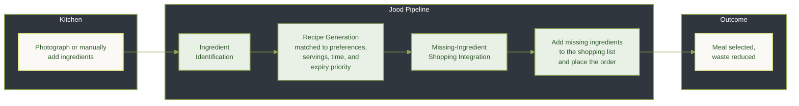
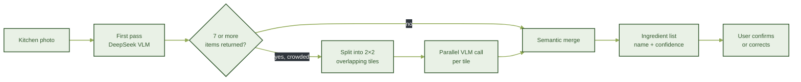
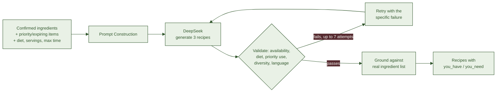
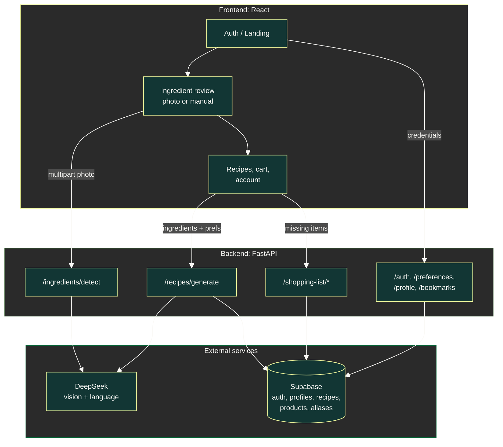

<br>
<div align="center">


<br />

An AI-powered platform that turns available ingredients into recipes that fit your meal preferences, helping you decide what to cook, make the most of what you have, and shop for what’s missing.


<br />


<br />

</div>

## 01 · Why Jood?

Having ingredients does not always mean knowing what to cook. Students and employees need meals that fit their time, and preferences, yet ingredients can remain unused until they go to waste.

In Saudi Arabia, food loss and waste stood at **27.9% in 2025**. A nationwide study published in 2021 also found that **63.6% of respondents reported wasting uncooked food during the previous four weeks**, highlighting an opportunity to help people use ingredients before they go to waste. [Saudi Press Agency](https://spa.gov.sa/en/N2410909) · [Nationwide study](https://www.mdpi.com/2304-8158/10/3/681)

<br>

## 02 · How Jood Helps

Jood addresses this gap by reducing ingredient identification, recipe selection, and shopping list assembly to a single automated pipeline, initiated from one photograph of the ingredients on hand.

- **Automated ingredient recognition.** A photograph of the fridge, shelf, or counter is processed to identify the ingredients present, which the user reviews and confirms prior to further use.
- **Preference-aware recipe generation.** Recipes are generated and validated against the confirmed ingredient set, stated dietary restrictions, and maximum preparation time, rather than retrieved from a static recipe database.
- **Waste-oriented prioritization.** Ingredients approaching expiry may be flagged, directing recipe generation to make use of them before spoilage occurs.
- **Missing-Ingredient Shopping Integration** Ingredients required by a selected recipe but absent from the confirmed set are matched against the store catalog and may be added to a shopping cart without additional user effort.

<br>



<div align="center">

<strong>Less guesswork. More from your ingredients.</strong>

<p dir="rtl">« الجُــود من الموجـود »</p>

</div>


## 03 · Features

<p align="center">
  From identifying what you have to deciding what to cook, Jood brings your ingredients, preferences, and shopping needs into one experience.
</p>

<br/>

<div align="center">

<table width="100%">

  <tr>
    <td width="50%" valign="top">
      <h3>
        
        &nbsp; Arabic-First Experience
      </h3>
      RTL layouts, Arabic-generated recipes, and familiar ingredient quantities for a natural cooking experience.
    </td>
    <td width="50%" valign="top">
      <h3>
        
        &nbsp; Ingredient Review
      </h3>
      Review detected ingredients, correct mistakes, and add or remove items before generating recipes.
    </td>
  </tr>

  <tr>
    <td width="50%" valign="top">
      <h3>
        
        &nbsp; Use-First Priorities
      </h3>
      Prioritize ingredients you want to use first, helping make the most of what is already available.
    </td>
    <td width="50%" valign="top">
      <h3>
        
        &nbsp; Personalized Recipes
      </h3>
      Generate recipes tailored to dietary needs, allergies, dislikes, preferred cuisines, servings, and preparation time.
    </td>
  </tr>

  <tr>
    <td width="50%" valign="top">
      <h3>
        
        &nbsp; Recipe Variety
      </h3>
      Explore three recipe suggestions with checks for repetitive combinations, offering more ways to use your ingredients.
    </td>
    <td width="50%" valign="top">
      <h3>
        
        &nbsp; Missing Ingredient Tracking
      </h3>
      Clearly distinguish ingredients you already have, common pantry staples, and missing items needed to complete a recipe.
    </td>
  </tr>

  <tr>
    <td width="50%" valign="top">
      <h3>
        
        &nbsp; Saved Recipes & Shopping List
      </h3>
      Save recipes for later and collect missing ingredients in one shopping list.
    </td>
    <td width="50%" valign="top">
      <h3>
        
        &nbsp; Account & Preferences
      </h3>
      Manage your profile and food preferences for a more consistent experience across recipe requests.
    </td>
  </tr>

</table>

</div>

<br>

## 04 · AI Pipeline

### 04.1 · Ingredient Detection


<br>

**Result**, on a held-out set of 22 real kitchen photos (103 ingredient labels, no confidence floor):

<div align="center">

<table>
  <tr>
    <th>Metric</th>
    <th>Evaluation Result</th>
  </tr>
  <tr>
    <td><b>Micro-Averaged F1 Score</b></td>
    <td><b>0.926</b></td>
  </tr>
  <tr>
    <td>Overall Detection Precision</td>
    <td>0.940</td>
  </tr>
  <tr>
    <td>Overall Detection Recall</td>
    <td>0.913</td>
  </tr>
  <tr>
    <td>Fully Correct Kitchen Images</td>
    <td>14 / 22</td>
  </tr>
  <tr>
    <td>Non-Food Objects Incorrectly Reported</td>
    <td>0</td>
  </tr>
  <tr>
    <td>Inference Latency</td>
    <td>18.6 s median · 50.8 s worst case</td>
  </tr>
</table>

</div>

<br>

>Full methodology and failure analysis: [`detection_benchmark/`](detection_benchmark/README.md).

### 04.2 · Recipe Generation



**Result**, on 27 functional test cases covering recipe constraints, user preferences, output consistency, and robustness:

<div align="center">

<table>
  <tr>
    <th>Metric</th>
    <th>Evaluation Result</th>
  </tr>
  <tr>
    <td><b>Overall Test Case Pass Rate</b></td>
    <td><b>100%</b></td>
  </tr>
  <tr>
    <td>Functional Test Cases Successfully Passed</td>
    <td>27 / 27</td>
  </tr>
  <tr>
    <td>User Constraint Adherence Validation</td>
    <td>Passed</td>
  </tr>
  <tr>
    <td>Output Structure & Reliability Validation</td>
    <td>Passed</td>
  </tr>
  <tr>
    <td>Recipe Generation Quality Checks</td>
    <td>Passed</td>
  </tr>
  <tr>
    <td>Robustness & Safety Validation</td>
    <td>Passed</td>
  </tr>
</table>

</div>
<br>

The recipe-generation service was validated across four main areas:

- **Constraint Adherence:** Allergies, dislikes, dietary preferences, servings, preparation time, and priority ingredients.
- **Output Reliability:** Arabic-only output, valid response schema, and no duplicate ingredients or recipe names.
- **Generation Quality Checks:** Recipe diversity and reasonable use of available ingredients.
- **Robustness & Safety:** Invalid inputs, oversized inputs, validation failures, and prompt-injection resistance.

<br>

## 05 · Tech stack

<div align="center">

<table>
  <tr>
    <th>Layer</th>
    <th>Stack</th>
  </tr>
  <tr>
    <td><b>Frontend</b></td>
    <td>React 19, Vite, React Router, Tailwind CSS 4, Lucide Icons</td>
  </tr>
  <tr>
    <td><b>Backend</b></td>
    <td>FastAPI, Pydantic, Uvicorn, python-multipart, python-dotenv</td>
  </tr>
  <tr>
    <td><b>AI</b></td>
    <td>DeepSeek (Vision + Language)</td>
  </tr>
  <tr>
    <td><b>Data & Auth</b></td>
    <td>Supabase (Postgres, Auth)</td>
  </tr>
  <tr>
    <td><b>Image Handling</b></td>
    <td>Pillow, pillow-heif (HEIC support for iPhone photo uploads)</td>
  </tr>
</table>

</div>


## 06 · System



## 07 · Project structure

```
Jood/
│
├── assets/                 Logos used in this README
│
├── backend/                FastAPI service
│   ├── models/                Pydantic request/response schemas
│   ├── routes/                auth, ingredients, recipes, shopping_list, ...
│   ├── services/              cv_service, llm_service, recipe_matching, store_service
│   └── requirements.txt       Pinned Python dependencies
│
├── detection_benchmark/    Standalone evaluation of the detection pipeline
│   └── README.md              Benchmark methodology and results
│
├── frontend/                React + Vite single-page app
│   ├── src/
│   │   ├── pages/                Landing, auth, Home, IngredientReview, Recipes, Cart, ...
│   │   └── services/             Fetch wrappers per backend route group
│   ├── .gitignore              Frontend-specific ignore rules
│   └── README.md               Frontend setup notes
│
├── .gitignore               Root-level ignore rules
└── README.md                This file
```

## 08 · Quick start

**Backend**
```bash
cd backend
python -m venv venv
.\venv\Scripts\Activate.ps1        # or source venv/bin/activate on macOS/Linux
pip install -r requirements.txt
```

Create `backend/.env`:
```
DEEPSEEK_API_KEY=...
SUPABASE_URL=...
SUPABASE_KEY=...
SUPABASE_SERVICE_ROLE_KEY=...
```

```bash
uvicorn main:app --reload --port 8000
```

**Frontend**
```bash
cd frontend
npm install
npm run dev
```

> If `backend/requirements.txt` changes, re-run `pip install -r requirements.txt` in the activated venv before starting the server again.

<br>

## 09 · The Team

<p align="center">
  <a href="https://github.com/RenadAlh">
    
  </a>
  <br /><br />
  <a href="https://github.com/Rawan-Alahmadi">
    
  </a>
  <br /><br />
  <a href="https://github.com/RanaAlsaggaf">
    
  </a>
  <br /><br />
  <a href="https://github.com/haifMohammed">
    
  </a>
</p>

---
<br>
<div align="center">


<br />

**Built by Jood Team** for the HungerStation AgentX challenge

<p dir="rtl">« الجُــود من الموجـود »</p>

</div>
